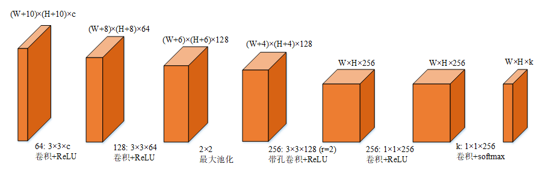

# DeepSeg
一种基于卷积神经网络的交互式图像目标提取及图像目标重新上色的方法。


## 网络特点


- 训练及测试均在一张图上完成，无需大量数据进行训练
- 训练时输入样本大小为11x11xc的图像方块，输出为1x1xk，对应此方块中心点的标签
- 测试时输入为原图像并做大小为5的padding，既(10+W)x(10+H)xc，输出为WxHxk

## 运行
- 依赖库 tensorflow, numpy, sklearn, cv2, [densecrf](https://github.com/lucasb-eyer/pydensecrf)

```shell
python DeepSeg.py -i 'data/flower.jpg' -s 'data/flower-1.png' -o 'data/out.jpg'
```